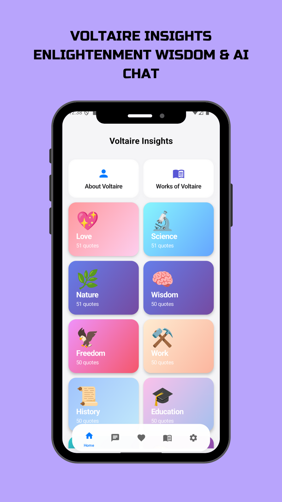
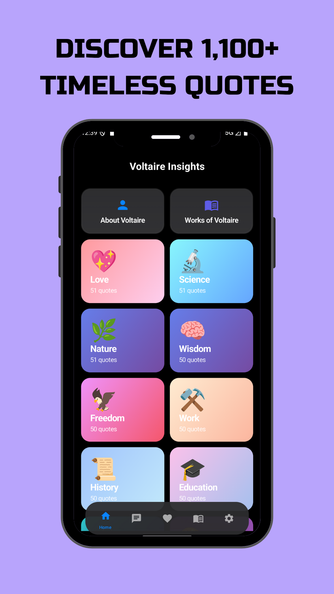
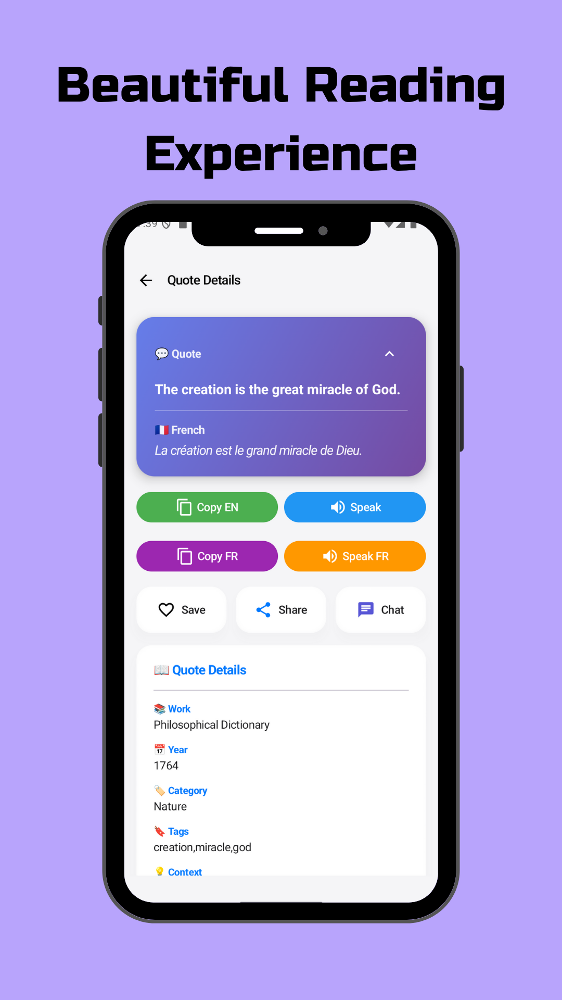
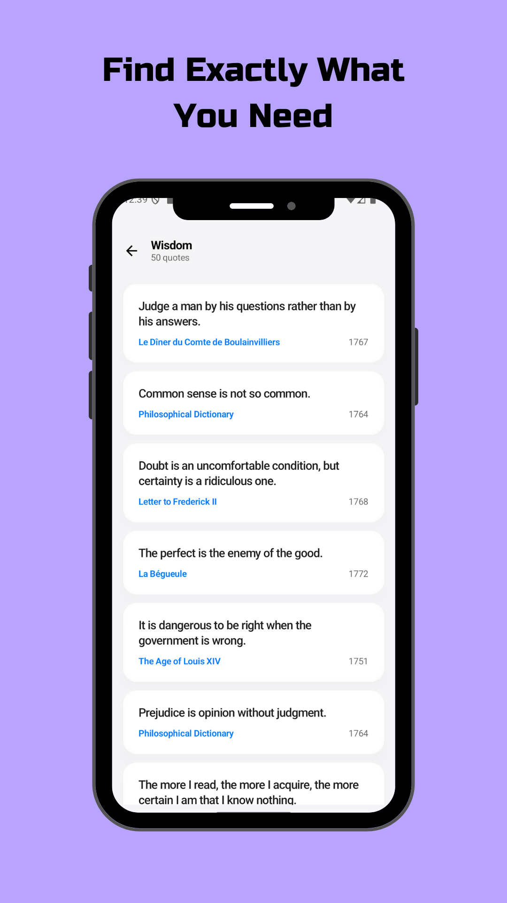
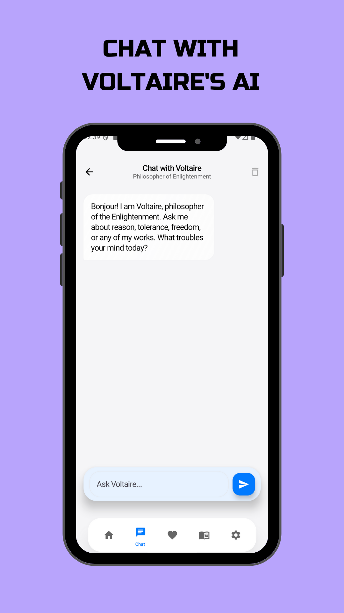
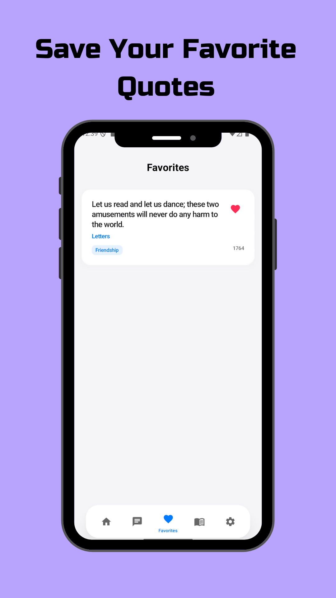
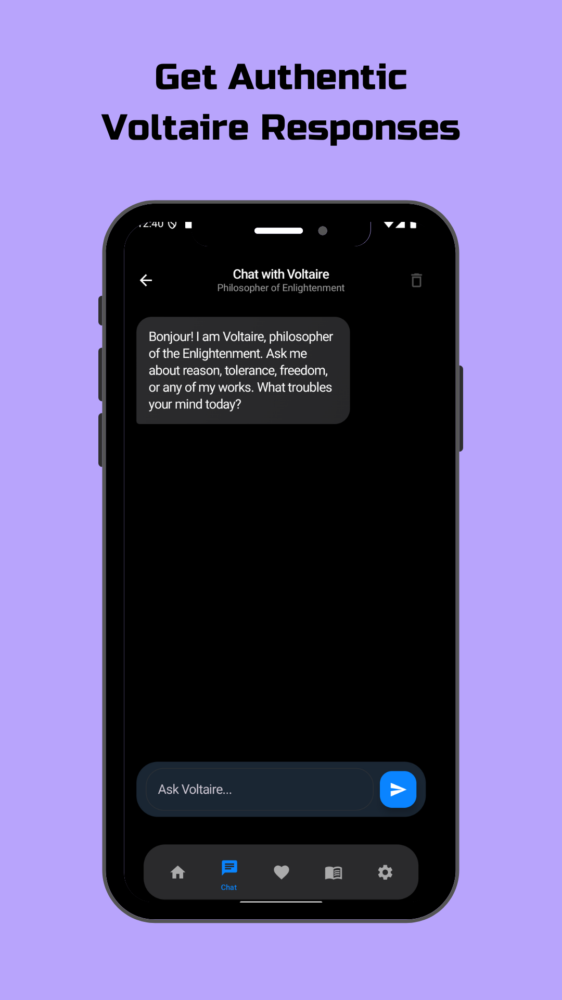
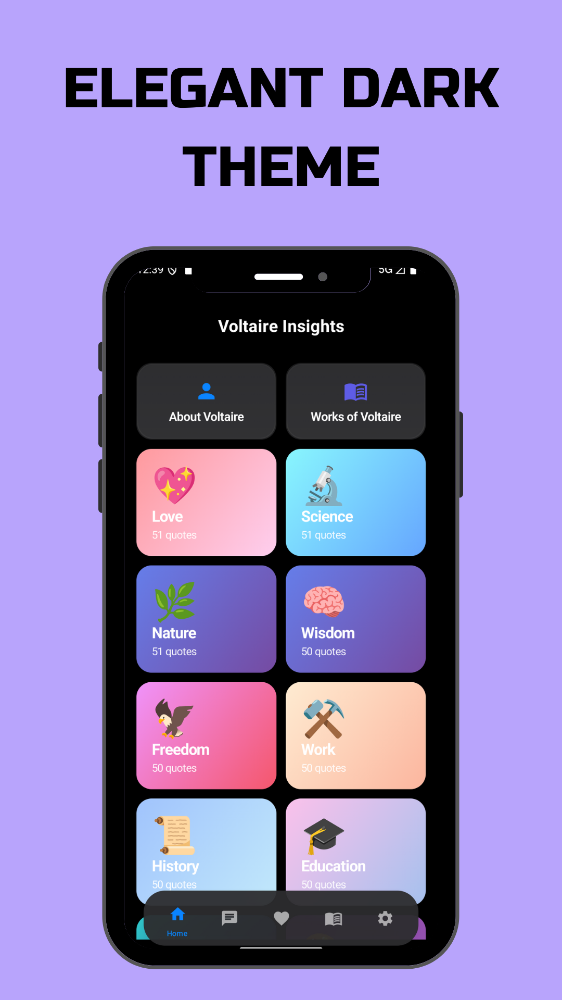

<div align="center">

# 📱 Voltaire Insights

### *Discover Timeless Wisdom Through Modern Design*

[](https://www.android.com/)
[](https://play.google.com/store/apps/details?id=com.kreggscode.voltairequotes)
[](https://kotlinlang.org/)
[](https://developer.android.com/jetpack/compose)
[](LICENSE)
[](https://android-arsenal.com/api?level=24)

*A beautifully crafted Android application bringing the profound wisdom of Voltaire to your fingertips with stunning UI/UX*

[Features](#-features) • [Screenshots](#-screenshots) • [Tech Stack](#-tech-stack) • [Installation](#-installation) • [Contributing](#-contributing)

---

</div>

## ✨ Features

<table>
<tr>
<td width="50%">

### 🎨 **Beautiful Design**

- 🌈 **Gradient Category Cards** with unique colors
- 🎭 **Glassmorphism Effects** and modern UI
- 🌓 **Dark & Light Themes** with smooth transitions
- ✨ **Smooth Animations** throughout the app
- 📱 **iOS-Inspired Interface** with floating navigation

</td>
<td width="50%">

### 📚 **Rich Content**

- 💬 **1000+ Voltaire Quotes** from his works
- 🗂️ **20+ Categories** (Wisdom, Freedom, Love, etc.)
- 🇫🇷 **French Translations** for authentic quotes
- 📖 **Literary Works** section with details
- 🔍 **Search & Filter** by category or work

</td>
</tr>
<tr>
<td width="50%">

### 🎯 **Smart Features**

- ⭐ **Favorites System** - Save your beloved quotes
- 🔔 **Daily Notifications** - Quote of the day at 9 AM
- 🎧 **Text-to-Speech** - Listen in English & French
- 📤 **Share Quotes** - Spread wisdom with friends
- 💾 **Offline Access** - Works without internet

</td>
<td width="50%">

### 🤖 **AI Integration**

- 💭 **Chat with Voltaire** - AI-powered conversations
- 🧠 **Pollination AI Ready** - Easy integration
- 💬 **Interactive Responses** - Discuss philosophy
- 📝 **Context-Aware** - Understands your questions

</td>
</tr>
</table>

## 🛠️ Tech Stack

<div align="center">

| Category | Technology |
|----------|------------|
| 🎨 **UI Framework** | Jetpack Compose (Material 3) |
| 💻 **Language** | Kotlin 1.9.24 |
| 🏗️ **Architecture** | MVVM + Repository Pattern |
| 💾 **Database** | Room with Coroutines & Flow |
| 🧭 **Navigation** | Compose Navigation |
| 🔄 **Async** | Kotlin Coroutines + Flow |
| 📦 **Serialization** | kotlinx.serialization |
| ⚙️ **Background** | WorkManager for notifications | 
| 🎯 **DI** | Manual (ViewModel Factory) |
| 📱 **Min SDK** | API 24 (Android 7.0+) |
| 🎯 **Target SDK** | API 34 (Android 14) |

</div>

## 📦 Project Structure

```
app/src/main/java/com/voltaire/insights/
├── data/
│   ├── QuoteDao.kt              # Room DAO
│   ├── QuoteDatabase.kt         # Room database
│   ├── QuoteRepository.kt       # Data repository
│   └── PreferencesManager.kt    # DataStore preferences
├── model/
│   ├── Quote.kt                 # Quote data model
│   └── Category.kt              # Category model
├── navigation/
│   └── NavGraph.kt              # Navigation graph
├── notifications/
│   ├── DailyQuoteWorker.kt      # WorkManager worker
│   └── NotificationScheduler.kt # Notification scheduler
├── ui/
│   ├── components/
│   │   ├── MorphismCard.kt      # Reusable morphism cards
│   │   └── FloatingBottomBar.kt # Bottom navigation
│   ├── screens/
│   │   ├── HomeScreen.kt
│   │   ├── ChatScreen.kt
│   │   ├── FavoritesScreen.kt
│   │   ├── WorksScreen.kt
│   │   ├── SettingsScreen.kt
│   │   ├── QuoteDetailScreen.kt
│   │   ├── CategoryQuotesScreen.kt
│   │   ├── WorkQuotesScreen.kt
│   │   └── AboutScreen.kt
│   └── theme/
│       ├── Color.kt             # iOS-inspired colors
│       ├── Theme.kt             # Theme configuration
│       └── Type.kt              # Typography
├── viewmodel/
│   ├── QuoteViewModel.kt        # Main ViewModel
│   └── ChatViewModel.kt         # Chat ViewModel
└── MainActivity.kt              # Main activity
```

## 🚀 Getting Started

### 📋 Prerequisites

```bash
✅ Android Studio Hedgehog (2023.1.1) or later
✅ JDK 17
✅ Android SDK 34
✅ Minimum Android 7.0 (API 24) device/emulator
```

### 📥 Installation

```bash
# 1. Clone the repository
git clone https://github.com/kreggscode/Voltaire-Insights.git
cd Voltaire-Insights

# 2. Open in Android Studio
# File → Open → Select the project folder

# 3. Sync Gradle (automatic)
# Wait for dependencies to download

# 4. Run the app
# Click the green ▶️ Run button or press Shift+F10
```

### 🎯 Quick Start

1. **First Launch**: The app will automatically load 1000+ quotes into the database
2. **Browse Categories**: Explore quotes by themes like Wisdom, Freedom, Love
3. **Save Favorites**: Tap the heart icon on any quote
4. **Enable Notifications**: Go to Settings → Toggle Daily Quotes
5. **Chat with Voltaire**: Use the AI chat feature (requires API setup)

### Dataset Files
The app uses two JSON datasets located in `app/src/main/assets/`:
- `dataset1.json` - Primary quotes dataset
- `dataset2.json` - Extended quotes with bio notes

These files are automatically loaded and merged on first launch.

## 🎨 Design Philosophy

<div align="center">

### *"Beauty in Simplicity, Wisdom in Design"*

</div>

<table>
<tr>
<td width="33%" align="center">

### 🎨 **Colors**

**Light Mode**
- Clean whites
- Soft grays
- Vibrant gradients

**Dark Mode**
- Deep blacks
- Subtle contrasts
- Bright accents

</td>
<td width="33%" align="center">

### ✍️ **Typography**

- iOS-inspired fonts
- Perfect spacing
- Clear hierarchy
- Readable sizes

</td>
<td width="33%" align="center">

### 🧩 **Components**

- Morphism cards
- Glass effects
- Floating navigation
- Smooth transitions

</td>
</tr>
</table>

## 🔮 Roadmap

<details>
<summary><b>🚀 Upcoming Features (Click to expand)</b></summary>

<br>

### 🎯 Version 2.0

- [ ] 🔍 **Advanced Search** - Full-text search across all quotes
- [ ] 🖼️ **Quote Images** - Generate beautiful quote cards
- [ ] 📱 **Home Widget** - Quote of the day on home screen
- [ ] 🌍 **Multi-language** - Support for Spanish, German, Italian
- [ ] 📄 **PDF Export** - Save favorites as PDF
- [ ] 🎨 **Custom Themes** - Create your own color schemes

### 🤖 AI Enhancements

- [ ] 🧠 **Smarter Chat** - Enhanced Pollination AI integration
- [ ] 💡 **Quote Recommendations** - AI-powered suggestions
- [ ] 📚 **Context Analysis** - Deeper philosophical insights

### 🎵 Social Features

- [ ] 👥 **Share Collections** - Create and share quote playlists
- [ ] 🏆 **Achievements** - Unlock badges for reading quotes
- [ ] 📊 **Reading Stats** - Track your philosophical journey

</details>

## 📱 Screenshots

<div align="center">

<table>
<tr>
<td width="33%" align="center">

**🏠 Home Screen**
<br><br>


*Beautiful category cards with unique gradient colors*

</td>
<td width="33%" align="center">

**💬 Chat Screen**
<br><br>


*AI-powered chat with Voltaire*

</td>
<td width="33%" align="center">

**⭐ Favorites**
<br><br>


*Saved quotes in one place*

</td>
</tr>
<tr>
<td width="33%" align="center">

**📚 Works**
<br><br>


*Voltaire's literary works*

</td>
<td width="33%" align="center">

**⚙️ Settings**
<br><br>


*Daily quotes, random quotes, and app preferences*

</td>
<td width="33%" align="center">

**💬 Quote Details**
<br><br>


*Full quote with French translation and actions*

</td>
</tr>
<tr>
<td width="50%" align="center">

**🎨 Category View**
<br><br>


*Quotes filtered by category*

</td>
<td width="50%" align="center">

**📱 App Overview**
<br><br>


*Beautiful floating navigation and modern design*

</td>
</tr>
</table>

</div>

## 🤝 Contributing

<div align="center">

### *Contributions are Welcome!*

</div>

We'd love your help making Voltaire Insights even better! Here's how:

1. 🍴 **Fork the repository**
2. 🌿 **Create a feature branch** (`git checkout -b feature/AmazingFeature`)
3. 💾 **Commit your changes** (`git commit -m 'Add some AmazingFeature'`)
4. 📤 **Push to the branch** (`git push origin feature/AmazingFeature`)
5. 🎉 **Open a Pull Request**

### 💡 Ways to Contribute

- 🐛 Report bugs and issues
- ✨ Suggest new features
- 📝 Improve documentation
- 🎨 Enhance UI/UX design
- 🌍 Add translations
- 🧪 Write tests

## 📄 License

<div align="center">

This project is licensed under the **MIT License** - see the [LICENSE](LICENSE) file for details.

*Free to use, modify, and distribute with attribution*

</div>

## 🙏 Acknowledgments

<div align="center">

### Special Thanks

**François-Marie Arouet (Voltaire)** - For centuries of timeless wisdom

**Open Source Community** - For amazing tools and libraries

**Jetpack Compose Team** - For revolutionizing Android UI development

---

### 📬 Contact & Support

[](https://github.com/kreggscode)
[](https://github.com/kreggscode/Voltaire-Insights)

---

<h3>⭐ Star this repo if you find it helpful!</h3>

<br>

### *"Judge a man by his questions rather than by his answers."*
**— Voltaire**

<br>

**Made with ❤️ for philosophy enthusiasts and beautiful design**

</div>
